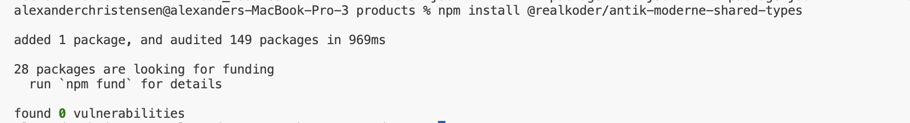

# Configuring the NPM project

## 1. First we configrued the project

```bash
mkdir shared-types
cd shared-types
npm init --scope=@your-org -y
```

## 2. Log in to npm

1. Open your terminal and run the following command, replacing `YOUR_GITHUB_USERNAME` with your actual GitHub username:
   ```bash
   npm login
   ```

## Step 3: Configure Your `package.json`

Ensure your `package.json` is set up correctly for GitHub Packages:

```json
{
  "name": "@your_github_username/your-package-name",
  "version": "1.0.0",
  "description": "Your package description",
  "main": "index.js",
  "publishConfig": {
    "registry": "https://registry.npmjs.org/",
    "access": "public"
  },
  "scripts": {
    "build": "tsc",
    "prepublish": "npm run build"
  },
  "description": "",
  "files": ["dist"],
  "dependencies": {
    // your dependencies
  },
  "devDependencies": {
    // your dev dependencies
  }
}
```

## Step 4. Setup TypeScript

```bash
npx tsc --init
```

Update the `ts.config`

```json
{
  "compilerOptions": {
    "target": "ES2020",
    "module": "CommonJS",
    "declaration": true,
    "outDir": "./dist",
    "strict": true,
    "esModuleInterop": true,
    "skipLibCheck": true
  },
  "include": ["src/**/*"],
  "exclude": ["node_modules"]
}
```

## Step 5: Build and publish

Run the following command to publish your package:

```bash
npm install

# Make sure to delete the ./dist folder before building
npm run build

# patching the version
npm version patch

# For GitHub Packages:
npm publish
```

## Step 6: Check for Errors

If you encounter any errors, check the logs for more details. You can find the logs in the path mentioned in the error message, such as:

# To further update package and build

```bash
# Check for Existing Versions
npm view @realkoder/antik-moderne-shared-types versions --registry=https://npm.pkg.github.com

# use npm version command to increment version automatically
npm version patch
```

## To install the npm package

```bash
npm install @realkoder/antik-moderne-shared-types@latest
```

_successfully installed the npm-package_

